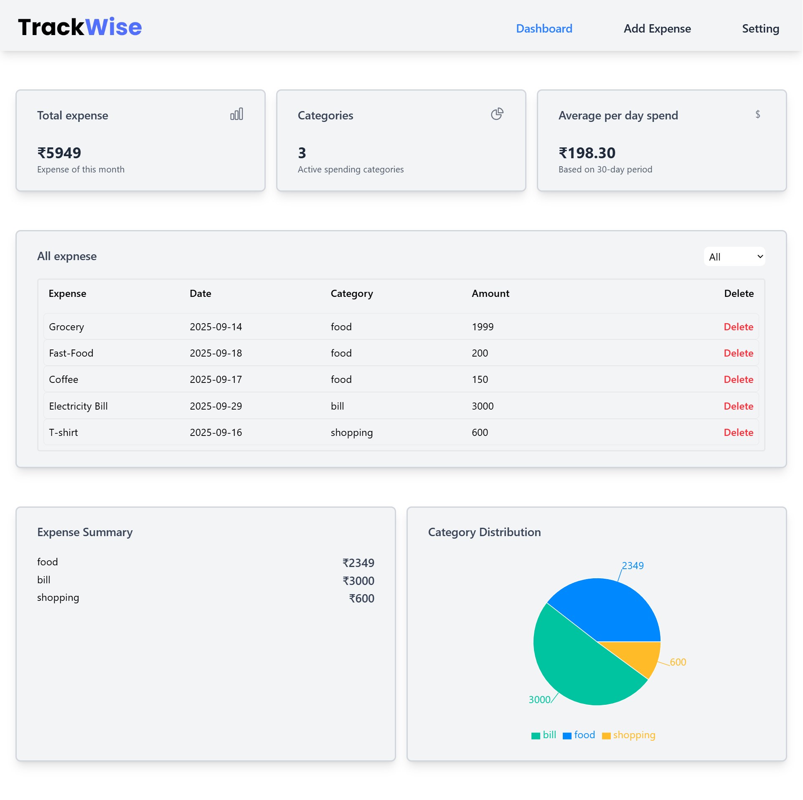
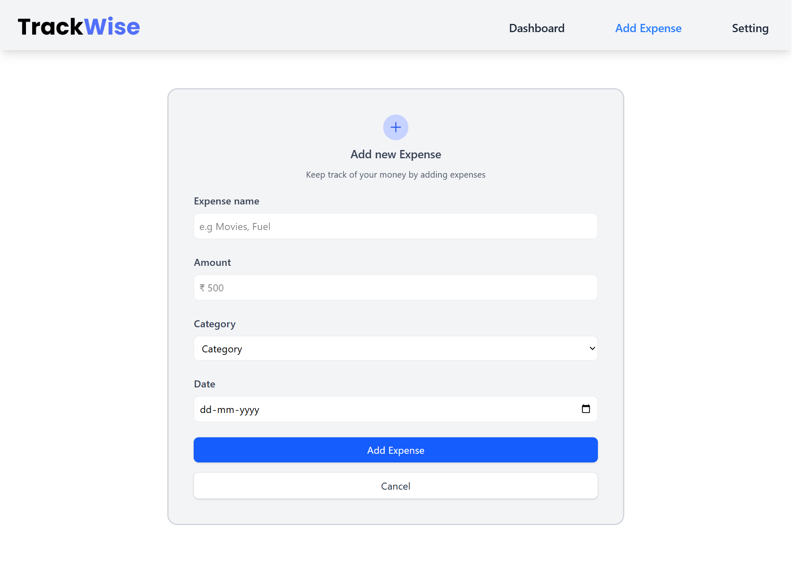
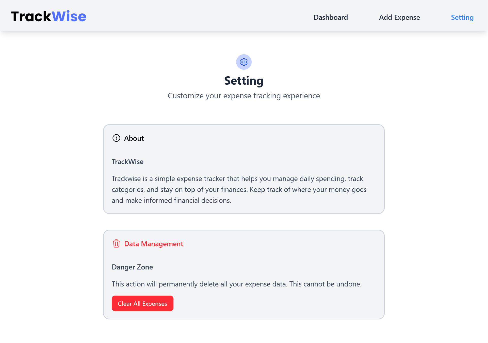

# Expense Tracker – Personal Finance Dashboard(TrackWise)

A simple personal finance tracker built with React and Tailwind CSS.  
Users can log daily expenses, categorize them, and view totals dynamically.

## 🔥 Features
- Add and categorize expenses
- Dynamic total calculation
- Real-time UI updates using React hooks
- Responsive dashboard layout
- Clean and modern design
- API integration (if applicable)

## 🛠️ Tech Stack
- React
- Tailwind CSS
- Vite

## 📸 Screens  

- **Dashboard** → See all your expenses, category summary, and charts 
    

- **Add Expense** → Add new expenses with name, amount, category, and date  
    

- **Settings** → Change currency, theme, and view app info  
    
  

## 🔗 Live link
https://trackwise-expense.vercel.app/

## 📂 GitHub Repository
https://github.com/itsgauravkumar07/Expense-Tracker

## 📦 Setup & Installation

```bash
git clone https://github.com/itsgauravkumar07/expense-tracker.git
cd expense tracker  
npm install  
npm run dev
